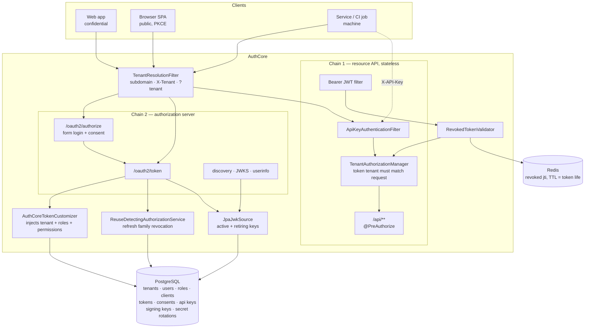
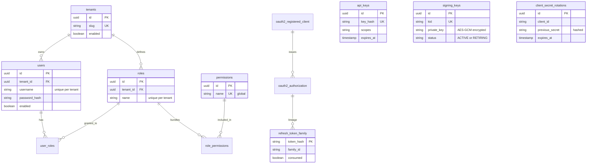

# AuthCore

A production-shaped OAuth2 / OpenID Connect authorization server built on Spring Authorization Server 7 and Java 21.

AuthCore issues RS256-signed JWTs for three different kinds of client — a server-side web app, a browser SPA, and a machine service — and enforces what each token holder may actually do through role- and permission-based access control. Multiple isolated tenants share one server, so the same username can belong to two unrelated people. Every credential, token, and consent decision lives in PostgreSQL, so nothing is lost across a restart.

A reference implementation, built to production security standards rather than to a deadline. PKCE is mandatory for public clients, refresh tokens rotate on every use, and replaying a retired refresh token revokes the entire token family per [OAuth 2.0 Security BCP §4.14](https://datatracker.ietf.org/doc/html/draft-ietf-oauth-security-topics). The [Known limitations](#known-limitations) section states plainly what it does not yet do.

Signing keys, client secrets, and tokens can all be rotated or revoked **while the server is running**, without invalidating anything that is still legitimately in use.

AuthCore is the issuer in a three-service platform. [**GateKeeper**](https://github.com/ezat141/gatekeeper) is the reactive gateway that verifies these tokens at the edge, and [**ledger-service**](https://github.com/ezat141/ledger-service) is a downstream that re-verifies them independently rather than trusting the gateway.

---

## What this means if you're hiring me

Most Spring Security work is configuring a library. This is the library's job, implemented from scratch.

| If you need | What this repo already shows |
|---|---|
| SSO / OAuth2 login for your API | The full authorization code + PKCE flow, working end to end |
| Secure token refresh | Rotation with reuse detection — a stolen token kills its whole family |
| Multi-tenant SaaS isolation | Two tenants, same username, provably invisible to each other |
| Zero-downtime key rotation | Rotate signing keys live; tokens signed by the old key keep working |
| Machine-to-machine access | Client credentials and API keys, sharing one authorization rule |
| Confidence it actually works | 65 tests against real PostgreSQL and Redis, not mocks |

Clone it and run `docker compose up -d && ./mvnw spring-boot:run`. Everything above is reproducible on your machine in about two minutes, and the [walkthroughs](#walkthroughs) are copy-pasteable `curl` commands with their real responses.

---

## Contents

- [Quickstart](#quickstart)
- [What it does](#what-it-does)
- [Architecture](#architecture)
- [Endpoints](#endpoints)
- [Seeded clients and users](#seeded-clients-and-users)
- [Walkthroughs](#walkthroughs)
- [Notable design decisions](#notable-design-decisions)
- [Data model](#data-model)
- [Testing](#testing)
- [Known limitations](#known-limitations)
- [Roadmap](#roadmap)

---

## Quickstart

Requires Docker and JDK 21.

```bash
git clone https://github.com/ezat141/authcore.git
cd authcore
docker compose up -d          # PostgreSQL, Redis, Kafka, Kafka-UI
./mvnw spring-boot:run        # .\mvnw.cmd on Windows
```

Flyway applies the schema and a seeder creates the demo clients and users on first boot. Confirm it is alive:

```bash
curl http://localhost:8080/.well-known/openid-configuration
```

Run the test suite (Testcontainers starts its own throwaway PostgreSQL, so Docker must be running):

```bash
./mvnw test
```

---

## What it does

| Capability | Detail |
|---|---|
| OpenID Connect discovery | `/.well-known/openid-configuration`, published JWKS |
| Authorization Code + PKCE | S256 challenge, mandatory for public clients |
| Refresh token rotation | New token on every refresh; the old one is retired |
| Reuse detection | Replaying a retired token revokes the whole family |
| Client credentials | Machine-to-machine tokens with no user involved |
| API keys | `X-API-Key` for callers that are not OAuth2 clients |
| RBAC | Users → roles → permissions, surfaced as JWT claims |
| Method security | `@PreAuthorize` including per-record ownership checks |
| Multi-tenancy | Tenant-scoped users and roles; tokens pinned to their tenant |
| Signing key rotation | Keys in PostgreSQL, encrypted at rest; retired keys keep verifying |
| Token revocation | Redis deny-list by `jti`; a revoked JWT stops working at once |
| Client secret rotation | Overlap window so clients can redeploy without an outage |
| Full persistence | Users, clients, tokens, and consents all in PostgreSQL |

**Stack:** Java 21 · Spring Boot 4.1 · Spring Authorization Server 7.1 · PostgreSQL 16 · Flyway · Testcontainers · Redis and Kafka (provisioned, reserved for later milestones)

---

## Architecture



Two security filter chains, split by purpose:

- **Chain 1** matches `/api/**` only. Stateless, no sessions, no CSRF — machine callers present a credential on every request. Accepts either a bearer JWT or an `X-API-Key`.
- **Chain 2** handles everything else: the OAuth2/OIDC protocol endpoints plus form login and the consent screen.

The split is deliberate rather than cosmetic. An earlier two-chain arrangement broke the authorization-code flow, because the request cache that stores the pending `/oauth2/authorize` request could not be restored across chain boundaries after login. `/api/**` never participates in that redirect, so it can be isolated safely while login and the protocol endpoints stay together.

`TenantResolutionFilter` runs first in both chains — the tenant has to be known before anything authenticates, since a username alone no longer identifies a person.

---

## Endpoints

### OAuth2 / OIDC

| Endpoint | Purpose | Auth |
|---|---|---|
| `GET /.well-known/openid-configuration` | Discovery document | public |
| `GET /oauth2/jwks` | Public signing keys | public |
| `GET /oauth2/authorize` | Authorization Code flow entry | user login |
| `POST /oauth2/token` | Token issuance and refresh | client credentials |
| `GET /userinfo` | OIDC user claims | bearer token |
| `POST /oauth2/revoke` | Token revocation | client credentials |
| `POST /oauth2/introspect` | Token introspection | client credentials |
| `GET /connect/logout` | RP-initiated logout | session |
| `GET /authorized` | Redirect landing page, displays the code | public |

### Demo resource API

| Endpoint | Guard |
|---|---|
| `GET /api/machine/payments` | `SCOPE_payments:read` — URL rule |
| `POST /api/machine/payments` | `SCOPE_payments:write` — URL rule |
| `GET /api/accounts/me` | any authenticated caller |
| `GET /api/accounts/{ownerId}` | `hasPermission(#ownerId, 'Account', 'read')` |
| `POST /api/accounts/{ownerId}/payments` | `hasAuthority('payments:write')` |
| `GET /api/accounts/admin/all` | `hasRole('ADMIN')` |

### Operator API

| Endpoint | Guard |
|---|---|
| `GET /api/admin/keys` | `hasAuthority('keys:read')` |
| `POST /api/admin/keys/rotate` | `hasAuthority('keys:rotate')` |
| `POST /api/admin/clients/{clientId}/rotate-secret` | `hasAuthority('clients:rotate-secret')` |
| `POST /api/admin/clients/{clientId}/revoke-previous-secrets` | `hasAuthority('clients:rotate-secret')` |

Key rotation has its own permission rather than sharing a general admin role — the set of people who should be able to re-key the server is smaller than the set who administer it.

---

## Seeded clients and users

Local development values, created on first boot.

### Tenants

| Slug | Name |
|---|---|
| `default` | Default Tenant |
| `acme` | Acme Corporation |

Select one per request via subdomain (`acme.authcore.local`), an `X-Tenant` header, or a `tenant` query parameter. Unspecified means `default`.

### Clients

| Client ID | Type | Grants | Secret |
|---|---|---|---|
| `authcore-client` | confidential | authorization_code, refresh_token | `secret` |
| `authcore-spa` | **public** (PKCE required) | authorization_code, refresh_token | none |
| `authcore-machine` | confidential | client_credentials | `machine-secret` |

Redirect URI for both interactive clients: `http://127.0.0.1:8080/authorized`

Clients are **not** tenant-scoped. One SPA serving many organisations is the ordinary SaaS shape — the tenant comes from who logs in, not from which app asked.

### Users

| Tenant | Username | Password | Role |
|---|---|---|---|
| `default` | `ezzat` | `password` | `ROLE_USER` |
| `default` | `admin` | `admin-password` | `ROLE_ADMIN` |
| `acme` | `ezzat` | `acme-password` | `ROLE_USER` |
| `acme` | `alice` | `alice-password` | `ROLE_ADMIN` |

The two `ezzat` rows are deliberate: different tenants, different passwords, different people. Usernames are unique per tenant, not globally.

| Role | Permissions |
|---|---|
| `ROLE_USER` | `accounts:read`, `payments:read` |
| `ROLE_ADMIN` | + `payments:write`, `accounts:read:all`, `keys:read`, `keys:rotate`, `clients:rotate-secret` |

Roles are defined per tenant, so each tenant owns its own `ROLE_ADMIN`. Permissions are global — they are a capability vocabulary, not policy.

### API key

| Name | Key | Scopes |
|---|---|---|
| `demo-reporting-job` | `ak_demo_reporting_job_local_only_0000000000` | `payments:read` |

> These are demo credentials for a local server that ships with no production configuration. Real deployments should seed nothing and provision credentials out of band.

---

## Walkthroughs

### 1. Authorization Code + PKCE (public client)

Open in a browser and log in as `ezzat` / `password`:

```
http://localhost:8080/oauth2/authorize?response_type=code&client_id=authcore-spa&redirect_uri=http://127.0.0.1:8080/authorized&scope=openid%20payments:read&code_challenge=jOE5exqeFE_I-Pd0J6sXoCuGr4fI1i-07DziFgujcnQ&code_challenge_method=S256
```

The browser lands on `http://127.0.0.1:8080/authorized`, which displays the code. Exchange it, sending **no client secret**:

```bash
curl -X POST http://localhost:8080/oauth2/token \
  -d "grant_type=authorization_code" \
  -d "client_id=authcore-spa" \
  -d "code=PASTE_CODE" \
  -d "redirect_uri=http://127.0.0.1:8080/authorized" \
  -d "code_verifier=authcore-test-code-verifier-minimum-43-chars-00"
```

The access token carries the user's actual capabilities, not just the client's requested scope:

```json
{
  "sub": "ezzat",
  "tenant": "default",
  "scope": ["openid", "payments:read"],
  "roles": ["USER"],
  "permissions": ["accounts:read", "payments:read"]
}
```

<details>
<summary>Windows PowerShell equivalents</summary>

PowerShell aliases `curl` to `Invoke-WebRequest`, which does not understand `-X` or `-d`. Use `curl.exe` explicitly:

```powershell
curl.exe -X POST http://localhost:8080/oauth2/token -d "grant_type=authorization_code&client_id=authcore-spa&code=PASTE_CODE&redirect_uri=http://127.0.0.1:8080/authorized&code_verifier=authcore-test-code-verifier-minimum-43-chars-00"
```
</details>

### 2. Refresh token rotation and reuse detection

```bash
# Refresh — returns a NEW refresh token, retiring the old one
curl -X POST http://localhost:8080/oauth2/token \
  -d "grant_type=refresh_token" -d "client_id=authcore-spa" -d "refresh_token=RT1"

# Replay the retired RT1 — this is what a stolen token looks like
curl -X POST http://localhost:8080/oauth2/token \
  -d "grant_type=refresh_token" -d "client_id=authcore-spa" -d "refresh_token=RT1"
# => {"error":"invalid_grant"}

# The legitimate RT2 is now dead too — the whole family was revoked
curl -X POST http://localhost:8080/oauth2/token \
  -d "grant_type=refresh_token" -d "client_id=authcore-spa" -d "refresh_token=RT2"
# => {"error":"invalid_grant"}
```

The server logs the decision:

```
WARN  Refresh token reuse detected for principal 'ezzat' (family cc51208a-...). Revoking the whole family.
```

Killing the victim's valid token looks harsh, and it is intentional. When a retired token reappears the server cannot tell the thief from the victim, so both are forced back through a full login. The attacker loses access; the user re-authenticates.

### 3. Machine-to-machine

```bash
# Client credentials — no user, no consent, no refresh token
curl -X POST http://localhost:8080/oauth2/token \
  -u authcore-machine:machine-secret \
  -d "grant_type=client_credentials&scope=payments:read"

curl http://localhost:8080/api/machine/payments -H "Authorization: Bearer ACCESS_TOKEN"

# Same endpoint, API key instead of a token
curl http://localhost:8080/api/machine/payments \
  -H "X-API-Key: ak_demo_reporting_job_local_only_0000000000"
```

Both succeed against the same endpoint under the same rule, because both produce `SCOPE_*` authorities.

### 4. RBAC in action

The same five requests, the same code, two different users:

| Request | `ezzat` (ROLE_USER) | `admin` (ROLE_ADMIN) |
|---|---|---|
| `GET /api/accounts/me` | 200 | 200 |
| `GET /api/accounts/{own}` | 200 | 200 |
| `GET /api/accounts/{other}` | **403** | **200** |
| `POST /api/accounts/{id}/payments` | **403** | **200** |
| `GET /api/accounts/admin/all` | **403** | **200** |

Nothing branches on the username. `admin` differs only by the rows linking it to `ROLE_ADMIN`.

### 5. Tenant isolation

Log in to Acme by adding `&tenant=acme` to the authorize URL. Use a private window so no session from a previous tenant is reused:

```
http://localhost:8080/oauth2/authorize?response_type=code&client_id=authcore-spa&redirect_uri=http://127.0.0.1:8080/authorized&scope=openid%20payments:read&code_challenge=jOE5exqeFE_I-Pd0J6sXoCuGr4fI1i-07DziFgujcnQ&code_challenge_method=S256&tenant=acme
```

Two logins worth trying, in order:

1. **`ezzat` / `password`** — the *default* tenant's password. Rejected. That user exists and that password is correct, but not here. The lookup is scoped to the tenant, so the other `ezzat` is not merely unauthorized — it is invisible.
2. **`ezzat` / `acme-password`** — Acme's own `ezzat`. Accepted.

The resulting token names its tenant:

```json
{ "sub": "ezzat", "tenant": "acme", "roles": ["USER"] }
```

That claim is enforced, not decorative. The same token, against two different tenants:

```bash
# Its own tenant
curl -i http://localhost:8080/api/accounts/ezzat \
  -H "Authorization: Bearer ACME_TOKEN" -H "X-Tenant: acme"
# => 200

# Someone else's tenant — same signature, same expiry, still refused
curl -i http://localhost:8080/api/accounts/ezzat \
  -H "Authorization: Bearer ACME_TOKEN" -H "X-Tenant: default"
# => 403
```

A valid signature proves the token is genuine. It says nothing about whether it is being used where it belongs.

### 6. Rotating the signing key

Needs an admin token (`admin` / `admin-password`, then the code exchange from walkthrough 1).

```bash
curl -X POST http://localhost:8080/api/admin/keys/rotate \
  -H "Authorization: Bearer ADMIN_TOKEN"
```

```
before:  5b10b917  ACTIVE       ← a token issued now carries this kid
         f66575a1  RETIRING

ROTATE → 3d2851f2  ACTIVE
         5b10b917  RETIRING
         f66575a1  RETIRING

token signed by the retired key  → 200   ← still valid
token issued after the rotation  → 200   ← carries kid 3d2851f2
JWKS                             → publishes all three
```

Re-keying is a live operation, not a maintenance window. That is the entire point: a rotation you are afraid to run is worse than no rotation button at all, because it creates the illusion of readiness. Retired keys are purged only once every token they signed has expired.

### 7. Revoking a token

```bash
curl -X POST http://localhost:8080/oauth2/revoke \
  -u authcore-machine:machine-secret \
  -d "token=ACCESS_TOKEN&token_type_hint=access_token"
```

```
before revoke        → 200
POST /oauth2/revoke  → 200
after revoke         → 401     ← immediate, not on expiry
Redis TTL            → 599s    ← the token's own remaining lifetime
a different token    → 200     ← blast radius of exactly one token
```

### 8. Rotating a client secret

```bash
curl -X POST http://localhost:8080/api/admin/clients/authcore-machine/rotate-secret \
  -H "Authorization: Bearer ADMIN_TOKEN"
```

```json
{
  "newSecret": "vWAGAi3AA-surqTPtQCUpuasQzcC94OkJkivTYEPd-0",
  "previousSecretAcceptedUntil": "2026-07-29T13:10:18Z"
}
```

During the window both secrets authenticate, and nothing else does:

```
OLD secret    → 200    ← an instance that has not been redeployed yet
NEW secret    → 200    ← one that has
WRONG secret  → 401    ← the window widened to exactly one secret
```

Closing it early, for when the old secret is known to have leaked:

```bash
curl -X POST http://localhost:8080/api/admin/clients/authcore-machine/revoke-previous-secrets \
  -H "Authorization: Bearer ADMIN_TOKEN"
# => {"revoked": 1}
#    OLD secret → 401,  NEW secret → 200
```

The new secret is returned once and stored hashed. Lose it and you rotate again rather than look it up.

---

## Notable design decisions

### Refresh tokens for public clients

Spring Authorization Server refuses to issue refresh tokens to public clients, and only authenticates a public client while a `code_verifier` is present — which is true during the code exchange and never during a refresh. That pairing is self-consistent, and it blocks the SPA refresh flow entirely.

The refusal predates rotation-with-reuse-detection. OAuth 2.0 Security BCP §4.14 permits refresh tokens for public clients provided they rotate and replays are detected, which is exactly what AuthCore implements. Three pieces close the gap:

- `RotatingRefreshTokenGenerator` — the stock generator minus the public-client refusal
- `PublicRefreshTokenAuthenticationConverter` / `...Provider` — authenticate a public client on the refresh grant, where no `code_verifier` exists

The converter tags its token with a private sentinel authentication method so that every built-in provider declines it. Without that, a built-in provider would run its PKCE-only path against a request that has no authorization code and throw an `IllegalArgumentException` — which `ProviderManager` does not catch, turning a bad request into a 500.

### Why reuse detection needs its own table

Rotation alone cannot detect replay. When SAS rotates a refresh token it overwrites the value on the authorization row, so by the time an attacker replays the old token there is nothing left to compare against — it is indistinguishable from a random string.

`refresh_token_family` records a SHA-256 hash of every issued refresh token along with its rotation lineage. `ReuseDetectingOAuth2AuthorizationService` decorates the JDBC service, checks that table before delegating, and revokes the entire family when a consumed token reappears.

### API keys are hashed with SHA-256, not bcrypt

This looks wrong until the threat model is considered. Passwords need a deliberately slow hash because they are low-entropy and guessable. An API key here is 32 random bytes — brute force is not the risk — and every request needs an indexed lookup by hash. Bcrypt would force a full table scan on every call while defending against an attack that cannot succeed anyway.

### Two authorization styles, chosen per problem

```java
// URL rule — right when the rule is "this path needs this scope"
.requestMatchers(GET, "/api/machine/**").hasAuthority("SCOPE_payments:read")

// Method rule — needed when the answer depends on the arguments
@PreAuthorize("hasPermission(#ownerId, 'Account', 'read')")
```

A URL pattern cannot see *which* account is being requested. `AuthCorePermissionEvaluator` fills that gap: a caller reaches their own record with `accounts:read`, or any record with `accounts:read:all`. The blanket grant stays deliberate instead of being the default.

### What is tenant-scoped, and what is not

Scoping everything uniformly would be simpler and wrong:

| | Scope | Why |
|---|---|---|
| Users | per tenant | `alice@acme` and `alice@globex` are different people; uniqueness is `(tenant, username)` |
| Roles | per tenant | Acme's `ROLE_ADMIN` must grant nothing at Globex |
| Permissions | global | A capability vocabulary (`payments:write`), not policy |
| Clients | global | One SPA serving many tenants is the ordinary SaaS shape |

The tenant is resolved from the subdomain, an `X-Tenant` header, or a `tenant` query parameter, and then held in a `ThreadLocal`. That is not the first choice for passing state, but `UserDetailsService.loadUserByUsername` accepts a username and nothing else, and Spring resolves the user deep inside the authentication machinery with no access to the request.

Resolution is sticky for the session, which is load-bearing rather than a convenience: the login form POST carries none of the original request's tenant hints, so without remembering it, every non-default user would be authenticated against the wrong tenant.

### Isolation is enforced in two places, because they are different problems

Scoping the user lookup prevents cross-tenant **authentication** — a user in another tenant is not found, so their password is never compared. It says nothing about a token that has already been issued.

`TenantAuthorizationManager` covers the second half. A correctly signed, unexpired token from tenant A would otherwise work perfectly against tenant B's data, because the signature proves the token is genuine, not that it is being used where it belongs. Callers with no tenant claim — client credentials, API keys — are left to the other rules, since they are not tenant-bound.

### Every safe operation must survive being run in production

The three rotation and revocation features solve one problem in three places: the naive implementation of each **looks correct and quietly turns the operation into an outage**, so nobody runs it.

| Operation | Naive behaviour | Here |
|---|---|---|
| Rotate signing key | delete the old key → every recent token rejected | old key keeps verifying until its tokens expire |
| Rotate client secret | replace in place → every un-redeployed instance breaks | both secrets valid for an overlap window |
| Revoke a JWT | mark the stored authorization invalid → nothing happens | `jti` deny-listed, refused immediately |

The third is the worst of them. Stock `/oauth2/revoke` marks the stored authorization invalid, which does nothing for a token a resource server validates by signature alone — so the endpoint returned `200` while the token kept working everywhere it mattered. That is more dangerous than having no revocation endpoint, because it looks like it worked.

A deliberate consequence: the deny-list is keyed by `jti` and each entry's TTL is the token's own remaining lifetime. A revoked token stops being interesting once it would have expired anyway, so the list is self-limiting, and it holds no credentials — leaking it reveals which tokens were revoked, not how to use any.

### One ACTIVE signing key, enforced by the database

```sql
CREATE UNIQUE INDEX idx_signing_keys_one_active
    ON signing_keys (status) WHERE status = 'ACTIVE';
```

Two active keys would be a bug no caller could ever detect: tokens verify either way, and *which* key signed them becomes a race. There is no failing request to alert on, so the invariant is enforced where it cannot be bypassed rather than trusted to application code.

Private keys are AES-GCM encrypted at rest. A stolen signing key forges every identity at once and leaves nothing in the audit log, so a database dump must not be enough to mint tokens. GCM rather than CBC so tampering is detected instead of decrypting to garbage. The master key lives in configuration, which moves the secret out of the database but not out of the deployment — a production system would hold it in a KMS so the private key is never assembled in application memory at all.

### Rotation broke token issuance, and the first fix was also wrong

Worth recording because the failure mode is instructive.

With two keys published, `NimbusJwtEncoder` finds both acceptable for RS256 and, by default, refuses to sign rather than choose. The first rotation therefore made **every token request fail** — at precisely the moment an operator would be rotating in anger.

The first attempt at a fix inspected the `JWKMatcher` to work out whether a query was "for signing". It guessed wrong: the real matcher is `.algorithms(RS256, null)`, and that `null` means keys with no algorithm set — exactly what ours are — also match. **The test written alongside it encoded the same wrong guess**, so it passed against a fix that did not work.

Reading the encoder's source showed it already has a documented hook for this, `setJwkSelector(List::getFirst)`, which is what the code now uses. The test drives the real encoder and asserts the `kid` it actually signs with, rather than asserting anything about how it queries.

### A custom principal needs a mixin *and* a type-validator entry

This one cost real debugging time and is worth writing down.

`JdbcOAuth2AuthorizationService` serialises the authenticated principal into the `attributes` column and reads it back when the code is exchanged. Storing the tenant on a custom `UserDetails` therefore requires that class to survive a JSON round trip.

The failure mode is unpleasant. **Writing succeeds with no warning** — the row lands in the database looking entirely correct. Only the read fails, one step later, surfacing as a bare `401` from the token endpoint with nothing in the response or the default logs mentioning serialisation. Two separate things are required, and having only the first still fails identically:

```java
BasicPolymorphicTypeValidator.Builder typeValidator = BasicPolymorphicTypeValidator.builder()
        .allowIfSubType(AuthCoreUserPrincipal.class);

JsonMapper.builder()
        .addModules(SecurityJacksonModules.getModules(classLoader, typeValidator))
        .addModule(new OAuth2AuthorizationServerJacksonModule())
        .addMixIn(AuthCoreUserPrincipal.class, AuthCoreUserPrincipalMixin.class)
        .build();
```

The mixin tells Jackson which constructor to call; the validator decides whether the class may be named as a type at all. The validator exists to stop stored JSON from instantiating arbitrary classes, so it is extended with one entry rather than disabled.

A version trap sits alongside it: Spring Authorization Server 7.1 ships adapters for both Jackson versions. The obvious-looking `OAuth2AuthorizationRowMapper` is the Jackson 2 one, while Spring Boot 4 uses Jackson 3 — the correct classes are `JsonMapperOAuth2Authorization*`.

### Claims are only useful once they are enforced

Two wiring steps that fail silently if missed, both worth knowing about:

1. SAS only auto-applies an `OAuth2TokenCustomizer` bean to the `JwtGenerator` it builds itself. AuthCore supplies its own generator, so the customizer is set explicitly — otherwise the `roles` and `permissions` claims simply never appear, with no error.
2. Spring's default JWT converter reads `scope` only. `AuthCoreJwtAuthoritiesConverter` also maps `roles` and `permissions`, otherwise those claims would be visible in the token but unenforced — decoration rather than authorization.

`scope` is kept alongside them rather than merged: scope is the ceiling the *client* was delegated, while roles and permissions describe the *user*. A request is permitted only when both agree.

---

## Data model



Eleven Flyway migrations, applied in order:

| Migration | Adds |
|---|---|
| `V1` | Baseline |
| `V2` | `users`, `user_authorities` |
| `V3` | `oauth2_registered_client` |
| `V4` | `oauth2_authorization` |
| `V5` | `oauth2_authorization_consent` |
| `V6` | `refresh_token_family` |
| `V7` | `api_keys` |
| `V8` | `roles`, `permissions`, join tables — migrates and drops `user_authorities` |
| `V9` | `tenants`; moves user and role uniqueness to `(tenant, name)` |
| `V10` | `signing_keys`, with a partial unique index enforcing one ACTIVE key |
| `V11` | `client_secret_rotations` |

`V8` copies existing authority assignments into the new role tables before dropping the old one, and `V9` assigns every pre-existing user and role to the `default` tenant before making `tenant_id` non-nullable. Neither drops data on upgrade.

---

## Testing

```bash
./mvnw test
```

65 tests. Integration tests run against real PostgreSQL and Redis via Testcontainers rather than in-memory substitutes, so migrations, SQL, and TTL behaviour are exercised as written.

| Suite | Covers |
|---|---|
| `OidcEndpointsTest` | Discovery and JWKS are public and well-formed |
| `MachineAccessIntegrationTest` | Client credentials and API key paths, allow and deny |
| `RefreshTokenReuseDetectionTest` | Honest refresh passes; replay revokes the family |
| `ApiKeyAuthenticationProviderTest` | Unknown, disabled, and expired keys |
| `PermissionEvaluatorTest` | Owner, non-owner, and `:all` permission combinations |
| `JwtAuthoritiesConverterTest` | Scope, role, and permission claim mapping |
| `TenantIsolationTest` | Users invisible across tenants; same username, different people |
| `TenantAuthorizationManagerTest` | A valid token from another tenant is refused |
| `TokenCustomizerTenantTest` | The tenant claim follows the principal, not the request |
| `SigningKeyRotationTest` | Rotation keeps signing working and old keys verifying |
| `KeyCipherTest` | Round trip, per-encryption nonce, tampering, wrong master key |
| `RevocationTest` | Deny-list behaviour against a real Redis |
| `RevocationEndToEndTest` | Revoke through the real endpoint → 401 on the next call |
| `ClientSecretRotationTest` | Both secrets valid during the overlap; wrong ones still refused |

Two of these are regression cover for defects that shipped and were caught by hand. `TokenCustomizerTenantTest` is described below; `SigningKeyRotationTest` pins the case where a rotation left the encoder unable to choose a key and broke token issuance entirely — and it deliberately drives the real encoder, because the *first* version of that test asserted an assumption about how the encoder queries keys, and that assumption was wrong.

The tenant test is regression cover for a defect the rest of the suite could not have caught: the tenant claim was originally read from the current request, which is empty during `/oauth2/token` because that call comes from the client's backend rather than the user's browser. Every test passed while every token carried the wrong tenant — the tests asserted the mechanism that had been built rather than the behaviour that was wanted. It was found by driving the browser flow by hand.

---

## Known limitations

Honest about what this is not, yet:

- **The signing-key master key sits in configuration.** Encryption at rest keeps a database dump from yielding usable keys, but the master key still lives in the deployment. A production system would hold it in a KMS or HSM.
- **The JWKS cache is per-instance**, with a 30-second TTL and local invalidation. A rotation on one node is visible to others within the TTL. The lag is safe in the only direction it occurs — a stale node keeps signing with a key that is still published — but a multi-node deployment wanting instant propagation would need a shared invalidation signal.
- **Clients are shared across tenants.** Deliberate — one app serving many organisations — but a deployment needing per-tenant client registration would have to replace `JdbcRegisteredClientRepository`.
- **No rate limiting or brute-force protection** on the token and login endpoints.
- **Demo credentials are seeded on boot**, which is convenient locally and wrong anywhere else.
- **Kafka is provisioned but unused** — it is placed for the audit-event milestone.

---

## Roadmap

| | Milestone | Status |
|---|---|---|
| M0 | Infrastructure and skeleton | ✅ |
| M1 | OIDC discovery and JWT issuance | ✅ |
| M2 | Full persistence | ✅ |
| M3 | PKCE, public clients, reuse detection | ✅ |
| M4 | Client credentials and API keys | ✅ |
| M5 | RBAC and method security | ✅ |
| M6 | Multi-tenancy | ✅ |
| M7 | Key rotation, revocation, secret rotation | ✅ |
| M8 | Account lockout and rate limiting | planned |
| M9 | MFA / TOTP with step-up | planned |
| M10 | Audit events and observability | planned |
| M11 | CI/CD, coverage gate, threat model | planned |

---

## License

MIT
