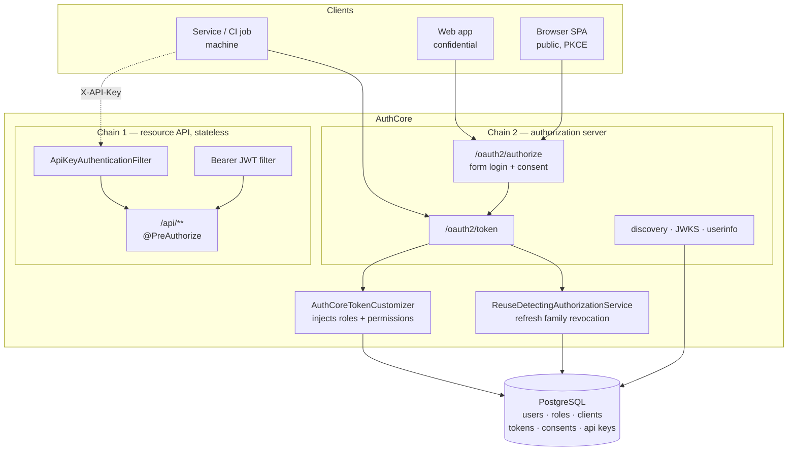
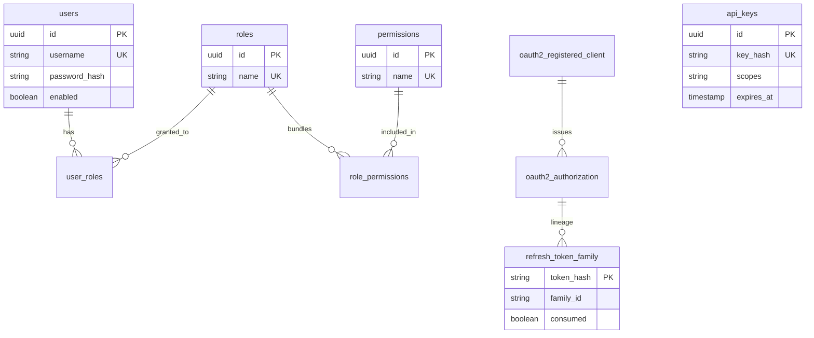

# AuthCore

A production-shaped OAuth2 / OpenID Connect authorization server built on Spring Authorization Server 7 and Java 21.

AuthCore issues RS256-signed JWTs for three different kinds of client — a server-side web app, a browser SPA, and a machine service — and enforces what each token holder may actually do through role- and permission-based access control. Every credential, token, and consent decision lives in PostgreSQL, so nothing is lost across a restart.

This is a learning-driven portfolio project, but the security decisions are the real ones: PKCE is mandatory for public clients, refresh tokens rotate on every use, and replaying a retired refresh token revokes the entire token family per [OAuth 2.0 Security BCP §4.14](https://datatracker.ietf.org/doc/html/draft-ietf-oauth-security-topics).

---

## Contents

- [Quickstart](#quickstart)
- [What it does](#what-it-does)
- [Architecture](#architecture)
- [Endpoints](#endpoints)
- [Seeded clients and users](#seeded-clients-and-users)
- [Walkthroughs](#walkthroughs)
- [Notable design decisions](#notable-design-decisions)
- [Data model](#data-model)
- [Testing](#testing)
- [Known limitations](#known-limitations)
- [Roadmap](#roadmap)

---

## Quickstart

Requires Docker and JDK 21.

```bash
git clone https://github.com/ezat141/authcore.git
cd authcore
docker compose up -d          # PostgreSQL, Redis, Kafka, Kafka-UI
./mvnw spring-boot:run        # .\mvnw.cmd on Windows
```

Flyway applies the schema and a seeder creates the demo clients and users on first boot. Confirm it is alive:

```bash
curl http://localhost:8080/.well-known/openid-configuration
```

Run the test suite (Testcontainers starts its own throwaway PostgreSQL, so Docker must be running):

```bash
./mvnw test
```

---

## What it does

| Capability | Detail |
|---|---|
| OpenID Connect discovery | `/.well-known/openid-configuration`, published JWKS |
| Authorization Code + PKCE | S256 challenge, mandatory for public clients |
| Refresh token rotation | New token on every refresh; the old one is retired |
| Reuse detection | Replaying a retired token revokes the whole family |
| Client credentials | Machine-to-machine tokens with no user involved |
| API keys | `X-API-Key` for callers that are not OAuth2 clients |
| RBAC | Users → roles → permissions, surfaced as JWT claims |
| Method security | `@PreAuthorize` including per-record ownership checks |
| Full persistence | Users, clients, tokens, and consents all in PostgreSQL |

**Stack:** Java 21 · Spring Boot 4.1 · Spring Authorization Server 7.1 · PostgreSQL 16 · Flyway · Testcontainers · Redis and Kafka (provisioned, reserved for later milestones)

---

## Architecture



Two security filter chains, split by purpose:

- **Chain 1** matches `/api/**` only. Stateless, no sessions, no CSRF — machine callers present a credential on every request. Accepts either a bearer JWT or an `X-API-Key`.
- **Chain 2** handles everything else: the OAuth2/OIDC protocol endpoints plus form login and the consent screen.

The split is deliberate rather than cosmetic. An earlier two-chain arrangement broke the authorization-code flow, because the request cache that stores the pending `/oauth2/authorize` request could not be restored across chain boundaries after login. `/api/**` never participates in that redirect, so it can be isolated safely while login and the protocol endpoints stay together.

---

## Endpoints

### OAuth2 / OIDC

| Endpoint | Purpose | Auth |
|---|---|---|
| `GET /.well-known/openid-configuration` | Discovery document | public |
| `GET /oauth2/jwks` | Public signing keys | public |
| `GET /oauth2/authorize` | Authorization Code flow entry | user login |
| `POST /oauth2/token` | Token issuance and refresh | client credentials |
| `GET /userinfo` | OIDC user claims | bearer token |
| `POST /oauth2/revoke` | Token revocation | client credentials |
| `POST /oauth2/introspect` | Token introspection | client credentials |
| `GET /connect/logout` | RP-initiated logout | session |

### Demo resource API

| Endpoint | Guard |
|---|---|
| `GET /api/machine/payments` | `SCOPE_payments:read` — URL rule |
| `POST /api/machine/payments` | `SCOPE_payments:write` — URL rule |
| `GET /api/accounts/me` | any authenticated caller |
| `GET /api/accounts/{ownerId}` | `hasPermission(#ownerId, 'Account', 'read')` |
| `POST /api/accounts/{ownerId}/payments` | `hasAuthority('payments:write')` |
| `GET /api/accounts/admin/all` | `hasRole('ADMIN')` |

---

## Seeded clients and users

Local development values, created on first boot.

### Clients

| Client ID | Type | Grants | Secret |
|---|---|---|---|
| `authcore-client` | confidential | authorization_code, refresh_token | `secret` |
| `authcore-spa` | **public** (PKCE required) | authorization_code, refresh_token | none |
| `authcore-machine` | confidential | client_credentials | `machine-secret` |

Redirect URI for both interactive clients: `http://127.0.0.1:8080/authorized`

### Users

| Username | Password | Role | Permissions |
|---|---|---|---|
| `ezzat` | `password` | `ROLE_USER` | `accounts:read`, `payments:read` |
| `admin` | `admin-password` | `ROLE_ADMIN` | + `payments:write`, `accounts:read:all` |

### API key

| Name | Key | Scopes |
|---|---|---|
| `demo-reporting-job` | `ak_demo_reporting_job_local_only_0000000000` | `payments:read` |

> These are demo credentials for a local server that ships with no production configuration. Real deployments should seed nothing and provision credentials out of band.

---

## Walkthroughs

### 1. Authorization Code + PKCE (public client)

Open in a browser and log in as `ezzat` / `password`:

```
http://localhost:8080/oauth2/authorize?response_type=code&client_id=authcore-spa&redirect_uri=http://127.0.0.1:8080/authorized&scope=openid%20payments:read&code_challenge=jOE5exqeFE_I-Pd0J6sXoCuGr4fI1i-07DziFgujcnQ&code_challenge_method=S256
```

The browser lands on `http://127.0.0.1:8080/authorized?code=...` — no page is served there, the code in the URL is the point. Exchange it, sending **no client secret**:

```bash
curl -X POST http://localhost:8080/oauth2/token \
  -d "grant_type=authorization_code" \
  -d "client_id=authcore-spa" \
  -d "code=PASTE_CODE" \
  -d "redirect_uri=http://127.0.0.1:8080/authorized" \
  -d "code_verifier=authcore-test-code-verifier-minimum-43-chars-00"
```

The access token carries the user's actual capabilities, not just the client's requested scope:

```json
{
  "sub": "ezzat",
  "scope": ["openid", "payments:read"],
  "roles": ["USER"],
  "permissions": ["accounts:read", "payments:read"]
}
```

<details>
<summary>Windows PowerShell equivalents</summary>

PowerShell aliases `curl` to `Invoke-WebRequest`, which does not understand `-X` or `-d`. Use `curl.exe` explicitly:

```powershell
curl.exe -X POST http://localhost:8080/oauth2/token -d "grant_type=authorization_code&client_id=authcore-spa&code=PASTE_CODE&redirect_uri=http://127.0.0.1:8080/authorized&code_verifier=authcore-test-code-verifier-minimum-43-chars-00"
```
</details>

### 2. Refresh token rotation and reuse detection

```bash
# Refresh — returns a NEW refresh token, retiring the old one
curl -X POST http://localhost:8080/oauth2/token \
  -d "grant_type=refresh_token" -d "client_id=authcore-spa" -d "refresh_token=RT1"

# Replay the retired RT1 — this is what a stolen token looks like
curl -X POST http://localhost:8080/oauth2/token \
  -d "grant_type=refresh_token" -d "client_id=authcore-spa" -d "refresh_token=RT1"
# => {"error":"invalid_grant"}

# The legitimate RT2 is now dead too — the whole family was revoked
curl -X POST http://localhost:8080/oauth2/token \
  -d "grant_type=refresh_token" -d "client_id=authcore-spa" -d "refresh_token=RT2"
# => {"error":"invalid_grant"}
```

The server logs the decision:

```
WARN  Refresh token reuse detected for principal 'ezzat' (family cc51208a-...). Revoking the whole family.
```

Killing the victim's valid token looks harsh, and it is intentional. When a retired token reappears the server cannot tell the thief from the victim, so both are forced back through a full login. The attacker loses access; the user re-authenticates.

### 3. Machine-to-machine

```bash
# Client credentials — no user, no consent, no refresh token
curl -X POST http://localhost:8080/oauth2/token \
  -u authcore-machine:machine-secret \
  -d "grant_type=client_credentials&scope=payments:read"

curl http://localhost:8080/api/machine/payments -H "Authorization: Bearer ACCESS_TOKEN"

# Same endpoint, API key instead of a token
curl http://localhost:8080/api/machine/payments \
  -H "X-API-Key: ak_demo_reporting_job_local_only_0000000000"
```

Both succeed against the same endpoint under the same rule, because both produce `SCOPE_*` authorities.

### 4. RBAC in action

The same five requests, the same code, two different users:

| Request | `ezzat` (ROLE_USER) | `admin` (ROLE_ADMIN) |
|---|---|---|
| `GET /api/accounts/me` | 200 | 200 |
| `GET /api/accounts/{own}` | 200 | 200 |
| `GET /api/accounts/{other}` | **403** | **200** |
| `POST /api/accounts/{id}/payments` | **403** | **200** |
| `GET /api/accounts/admin/all` | **403** | **200** |

Nothing branches on the username. `admin` differs only by the rows linking it to `ROLE_ADMIN`.

---

## Notable design decisions

### Refresh tokens for public clients

Spring Authorization Server refuses to issue refresh tokens to public clients, and only authenticates a public client while a `code_verifier` is present — which is true during the code exchange and never during a refresh. That pairing is self-consistent, and it blocks the SPA refresh flow entirely.

The refusal predates rotation-with-reuse-detection. OAuth 2.0 Security BCP §4.14 permits refresh tokens for public clients provided they rotate and replays are detected, which is exactly what AuthCore implements. Three pieces close the gap:

- `RotatingRefreshTokenGenerator` — the stock generator minus the public-client refusal
- `PublicRefreshTokenAuthenticationConverter` / `...Provider` — authenticate a public client on the refresh grant, where no `code_verifier` exists

The converter tags its token with a private sentinel authentication method so that every built-in provider declines it. Without that, a built-in provider would run its PKCE-only path against a request that has no authorization code and throw an `IllegalArgumentException` — which `ProviderManager` does not catch, turning a bad request into a 500.

### Why reuse detection needs its own table

Rotation alone cannot detect replay. When SAS rotates a refresh token it overwrites the value on the authorization row, so by the time an attacker replays the old token there is nothing left to compare against — it is indistinguishable from a random string.

`refresh_token_family` records a SHA-256 hash of every issued refresh token along with its rotation lineage. `ReuseDetectingOAuth2AuthorizationService` decorates the JDBC service, checks that table before delegating, and revokes the entire family when a consumed token reappears.

### API keys are hashed with SHA-256, not bcrypt

This looks wrong until the threat model is considered. Passwords need a deliberately slow hash because they are low-entropy and guessable. An API key here is 32 random bytes — brute force is not the risk — and every request needs an indexed lookup by hash. Bcrypt would force a full table scan on every call while defending against an attack that cannot succeed anyway.

### Two authorization styles, chosen per problem

```java
// URL rule — right when the rule is "this path needs this scope"
.requestMatchers(GET, "/api/machine/**").hasAuthority("SCOPE_payments:read")

// Method rule — needed when the answer depends on the arguments
@PreAuthorize("hasPermission(#ownerId, 'Account', 'read')")
```

A URL pattern cannot see *which* account is being requested. `AuthCorePermissionEvaluator` fills that gap: a caller reaches their own record with `accounts:read`, or any record with `accounts:read:all`. The blanket grant stays deliberate instead of being the default.

### Claims are only useful once they are enforced

Two wiring steps that fail silently if missed, both worth knowing about:

1. SAS only auto-applies an `OAuth2TokenCustomizer` bean to the `JwtGenerator` it builds itself. AuthCore supplies its own generator, so the customizer is set explicitly — otherwise the `roles` and `permissions` claims simply never appear, with no error.
2. Spring's default JWT converter reads `scope` only. `AuthCoreJwtAuthoritiesConverter` also maps `roles` and `permissions`, otherwise those claims would be visible in the token but unenforced — decoration rather than authorization.

`scope` is kept alongside them rather than merged: scope is the ceiling the *client* was delegated, while roles and permissions describe the *user*. A request is permitted only when both agree.

---

## Data model



Eight Flyway migrations, applied in order:

| Migration | Adds |
|---|---|
| `V1` | Baseline |
| `V2` | `users`, `user_authorities` |
| `V3` | `oauth2_registered_client` |
| `V4` | `oauth2_authorization` |
| `V5` | `oauth2_authorization_consent` |
| `V6` | `refresh_token_family` |
| `V7` | `api_keys` |
| `V8` | `roles`, `permissions`, join tables — migrates and drops `user_authorities` |

`V8` copies existing authority assignments into the new role tables before dropping the old one, so no grants are lost on upgrade.

---

## Testing

```bash
./mvnw test
```

27 tests. Integration tests run against a real PostgreSQL via Testcontainers rather than an in-memory substitute, so migrations and SQL are exercised as written.

| Suite | Covers |
|---|---|
| `OidcEndpointsTest` | Discovery and JWKS are public and well-formed |
| `MachineAccessIntegrationTest` | Client credentials and API key paths, allow and deny |
| `RefreshTokenReuseDetectionTest` | Honest refresh passes; replay revokes the family |
| `ApiKeyAuthenticationProviderTest` | Unknown, disabled, and expired keys |
| `PermissionEvaluatorTest` | Owner, non-owner, and `:all` permission combinations |
| `JwtAuthoritiesConverterTest` | Scope, role, and permission claim mapping |

---

## Known limitations

Honest about what this is not, yet:

- **Signing keys are generated in memory at startup.** Every restart invalidates previously issued tokens. Persisted keys with rotation are the next milestone.
- **No multi-tenancy.** Single realm; tenant isolation is planned.
- **No rate limiting or brute-force protection** on the token or login endpoints.
- **Demo credentials are seeded on boot**, which is convenient locally and wrong anywhere else.
- **Redis and Kafka are provisioned but unused** — they are placed for the sessions and audit-event milestones.

---

## Roadmap

| | Milestone | Status |
|---|---|---|
| M0 | Infrastructure and skeleton | ✅ |
| M1 | OIDC discovery and JWT issuance | ✅ |
| M2 | Full persistence | ✅ |
| M3 | PKCE, public clients, reuse detection | ✅ |
| M4 | Client credentials and API keys | ✅ |
| M5 | RBAC and method security | ✅ |
| M6 | Multi-tenancy | planned |
| M7 | Key rotation and JWKS management | planned |
| M8–M11 | Audit events, MFA, observability, hardening | planned |

---

## License

MIT
